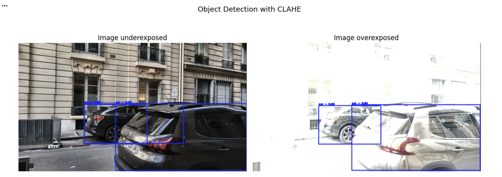

# image_quality_techniques
Repository for the module#2 of ThinkAutonomous' 3D Computer Vision program:
https://www.thinkautonomous.ai/courses

This notebook shows 4 techniques to diagnose and fix degraded images 
- Histogram Stretching
- Histogram Equalization
- Contrast Limited Adaptive Histogram Equalization
- Gamma Correction

